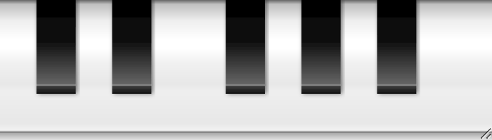

<h1>
x-pianokeys <a href="https://npmjs.org/package/x-pianokeys"></a> <a href="src"></a> <a href="https://cdn.jsdelivr.net/npm/x-pianokeys@3.0.0/dist/x-pianokeys.min.js"></a> <a href="LICENSE"></a>
</h1>

<p></p>

Web Component MIDI ready piano keys.

<h4>
<table><tr><td title="Triple click to select and copy paste">
<code>npm i x-pianokeys </code>
</td><td title="Triple click to select and copy paste">
<code>pnpm add x-pianokeys </code>
</td><td title="Triple click to select and copy paste">
<code>yarn add x-pianokeys</code>
</td></tr></table>
</h4>

## Examples

<details id="example$web" title="web" open><summary><span><a href="#example$web">#</a></span>  <code><strong>web</strong></code></summary>  <ul><p></p>  <a href="https://stagas.github.io/x-pianokeys/example/web.html"></img>  <p><strong>Try it live</strong></p></a>    <details id="source$web" title="web source code" ><summary><span><a href="#source$web">#</a></span>  <code><strong>view source</strong></code></summary>  <a href="example/web.tsx">example/web.tsx</a>  <p>

```tsx
/** @jsxImportSource minimal-view */

import { render } from 'minimal-view'

import { PianoKeys } from 'x-pianokeys'

document.body.innerHTML = /*html*/ `
<style>
html, body {
  width: 100%;
  height: 100%;
}
.piano {
  resize: both;
  overflow: hidden;
}
</style>
<div id="demo" style="display: flex; gap:20px"></div>
`
const audioContext = new AudioContext()
render(
  <>
    <div style="height:250px;width:50px">
    <PianoKeys
      halfOctaves={3}
      startHalfOctave={1}
      vertical
      audioContext={audioContext}
      onMidiEvent={() => { }}
    />
    </div>

    <div style="height:250px;width:50px">
    <PianoKeys
      halfOctaves={2}
      startHalfOctave={1}
      vertical
      audioContext={audioContext}
      onMidiEvent={() => { }}
    />
    </div>

    <div style="height:250px;width:50px">
    <PianoKeys
      halfOctaves={3}
      startHalfOctave={0}
      vertical
      audioContext={audioContext}
      onMidiEvent={() => { }}
    />
    </div>

    <div style="height:250px;width:50px">
    <PianoKeys
      halfOctaves={2}
      startHalfOctave={0}
      vertical
      audioContext={audioContext}
      onMidiEvent={() => { }}
    />
    </div>
  </>,
  document.getElementById('demo')!
)
// setTimeout(() => {
//   document.querySelector('x-piano')!.turnOnKey(2)
//   document.querySelector('x-piano')!.turnOnKey(5)
//   document.querySelector('x-piano')!.turnOnKey(3)
// }, 1000)
// <div class="piano" style="width:100px;height:350px;">
//   <x-piano vertical onmidimessage="console.log(event)"></x-piano>
// </div>

// for demo: requestAnimationFrame <- for shoty
// const pianos = document.querySelectorAll('x-piano') as NodeListOf<PianoKeysElement>
// let ivl = setInterval(() => {
//   const piano = pianos[Math.random() * pianos.length | 0]
//   const note = Math.random() * 20 | 0
//   piano.turnOnKey?.(note)
//   setTimeout(() => piano.turnOffKey?.(note), Math.random() * 1500)
// }, 50)
// setTimeout(() => {
//   clearInterval(ivl)
// }, 1000)
```

</p>
</details></ul></details>


## API

<p>  <details id="MidiEvents$1" title="TypeAlias" open><summary><span><a href="#MidiEvents$1">#</a></span>  <code><strong>MidiEvents</strong></code>    </summary>  <a href=""></a>  <ul><p>{<p>  <details id="midimessage$3" title="Property" ><summary><span><a href="#midimessage$3">#</a></span>  <code><strong>midimessage</strong></code>    </summary>  <a href=""></a>  <ul><p><span>WebMidi.MIDIMessageEvent</span></p>        </ul></details></p>}</p>        </ul></details><details id="PianoKeys$4" title="Function" open><summary><span><a href="#PianoKeys$4">#</a></span>  <code><strong>PianoKeys</strong></code><em>(props)</em>    </summary>  <a href=""></a>  <ul>    <p>    <details id="props$6" title="Parameter" ><summary><span><a href="#props$6">#</a></span>  <code><strong>props</strong></code>    </summary>    <ul><p><span>props</span></p>        </ul></details>  <p><strong>PianoKeys</strong><em>(props)</em>  &nbsp;=&gt;  <ul><span>VKid</span></ul></p></p>    </ul></details></p>

## Credits
- [minimal-view](https://npmjs.org/package/minimal-view) by [stagas](https://github.com/stagas) &ndash; Minimal reactive component view library.
- [to-fluent](https://npmjs.org/package/to-fluent) by [stagas](https://github.com/stagas) &ndash; Convert a function with a settings object to fluent API.

## Contributing

[Fork](https://github.com/stagas/x-pianokeys/fork) or [edit](https://github.dev/stagas/x-pianokeys) and submit a PR.

All contributions are welcome!

## License

<a href="LICENSE">MIT</a> &copy; 2023 [stagas](https://github.com/stagas)
